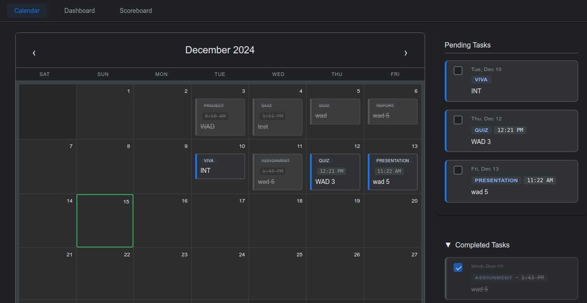

# DIUmate 🎓

A modern academic task management system designed for Daffodil International University students.

## 🌟 Features

### For Students
- 📅 Interactive Calendar View
- ✅ Task Management System
- ⏰ Smart Reminder System
- 📱 Responsive Design (Mobile & Desktop)
- 🌙 Dark Mode Support
- 📊 Progress Tracking (Coming Soon)
- 🏆 Scoreboard System (Coming Soon)

### For Developers
- 🔧 Modular Architecture
- 💾 Local Storage Integration
- 🎨 Material Design Implementation
- 📦 No External Dependencies
- 🌐 Cross-browser Compatible

## 🚀 Quick Start

### For Users

1. Visit [DIUmate Web App](https://ar-arif.github.io/DIUmate/)
2. Allow notifications for reminders (optional)
3. Start adding your academic tasks!

#### Using the Calendar
- Click on any date to add a new task
- Click on existing tasks to edit or delete them
- Tasks are color-coded based on their type
- Today's date is highlighted with a green border

#### Managing Tasks
- Add tasks with title, type, description, and time
- Set reminders (1 hour, 2 hours, 1 day before, or custom)
- Mark tasks as completed
- View all tasks in the side panel
- Toggle completed tasks visibility

#### Dark Mode
- Automatically adapts to your system preferences
- Provides comfortable viewing in low-light conditions

### For Developers

1. Clone the repository:

## 📝 License

This project is licensed under the MIT License - see the [LICENSE](LICENSE) file for details.
